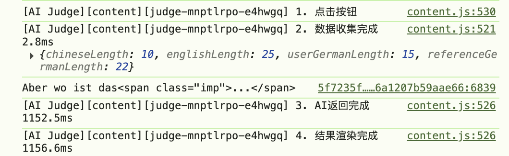

# Sharplingo AI Judge

一个面向 Sharplingo 德语翻译练习页的 Chrome / Edge Manifest V3 扩展。它会在题目操作区注入 `AI评判` 按钮，读取当前题目的原句、用户作答和页面参考答案，再调用用户自定义的 OpenAI 兼容接口返回结构化点评。

## 功能

- 在 Sharplingo 课程页面注入 `AI评判` 按钮
- 自动收集中文原句、英文辅助原句、用户德语答案、页面参考答案
- 支持自定义 OpenAI 兼容接口、模型名和提示词模板
- 以结构化结果展示摘要和问题说明
- 通过可选域名权限访问任意兼容 API

## 截图

当前仓库附带一张耗时打点示例图，展示 `gpt-4o-mini` 配置下从点击到返回的整体耗时。

## 项目结构

- `manifest.json`: 扩展入口与权限声明
- `content.js`: 页面注入、题目抓取、结果渲染
- `background.js`: 读取配置并调用模型 API
- `options.html` / `options.js`: API 配置与提示词模板设置
- `popup.html` / `popup.js`: 快速打开设置页
- `styles.css`: 页面内结果卡片样式

## 本地加载

1. 打开 Chrome 或 Edge
2. 进入 `chrome://extensions/`
3. 打开右上角“开发者模式”
4. 点击“加载已解压的扩展程序”
5. 选择当前项目目录

## 配置

1. 打开扩展弹窗，进入设置页
2. 填写以下内容：
   - `API Base URL`，例如 `https://api.openai.com/v1`
   - `API Key`
   - `模型名`
   - 可选的提示词模板
   - 可选的调试日志开关
3. 点击“保存配置”
4. 首次保存时，扩展会申请该 API 域名的网络权限

运行时配置说明：

- `API Base URL`、`API Key`、模型名和提示词模板保存在浏览器的 `chrome.storage.sync`
- 调试日志默认关闭，需要时可在设置页开启

## 使用方法

1. 打开 Sharplingo 的翻译练习页
2. 输入德语答案
3. 点击页面里的 `AI评判`
4. 等待模型返回摘要和问题说明

## 兼容接口

本项目使用 OpenAI 兼容的 Chat Completions 风格请求：

- 路径：`/v1/chat/completions`
- 关键字段：`model`、`messages`、`temperature`、`max_tokens`
- 默认要求模型只返回 JSON 结果

已验证的思路：

- 通用 OpenAI 兼容服务
- DashScope 兼容模式
- 第三方 OpenAI 代理

说明：

- 某些服务虽然声称“兼容 OpenAI”，但不一定完整支持 `response_format`
- 不同模型和服务端的延迟差异会很大，耗时打点通常比猜测更有效

## 调试建议

如果你怀疑“AI返回慢”，优先对以下阶段打点：

- 页面数据收集
- `chrome.runtime.sendMessage`
- background 中的配置读取与 prompt 构建
- `fetch`
- `response.json()`
- 模型返回内容的 JSON 解析

在实际排查里，如果 `fetch` 占据绝大多数耗时，而其余阶段都只要几毫秒，问题通常不在扩展代码，而在模型服务、网关或网络链路。

## 已知假设

当前版本依赖 Sharplingo 页面中这些选择器或近似结构：

- 中文：`span.translation-chinese-span`
- 英文：`span.translation-span`
- 输入框：`textarea.translation_sentence_textarea`
- 参考答案：`.sentence-div.sentence`

如果 Sharplingo 修改了 DOM 结构，需要同步调整 `content.js` 的取数逻辑。

## 版本

- `v0.1.0`: 初始公开版本，包含 AI 评判、配置页、OpenAI 兼容接口调用和基础耗时打点
